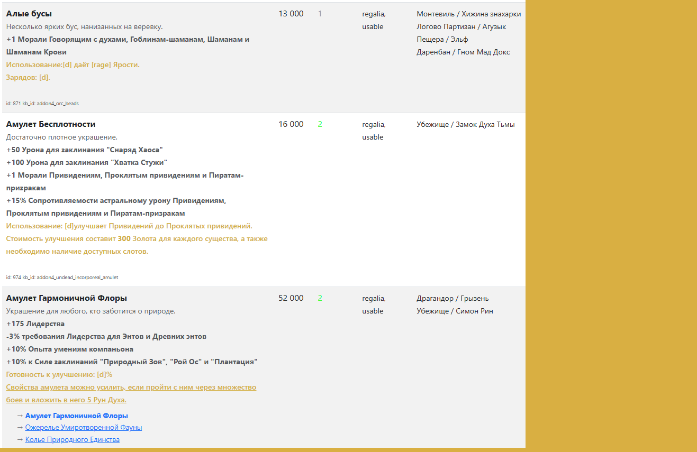

# King's Bounty Tracker

Веб-приложение для отслеживания предметов, заклинаний и существ в играх серии King's Bounty.

[English version below](#english-version)

---



## Ключевые возможности

### 📖 Просмотр игровой базы данных
- Просмотр всех предметов, заклинаний и существ из игры
- Подробная информация о каждой сущности (характеристики, описания, требования)
- Удобный поиск и фильтрация

### 🔍 Декомпилятор и парсер файлов сохранений
- Автоматическое извлечение данных из файлов сохранений
- Анализ всех объектов с инвентарём (предметы, заклинания, существа, гарнизоны)

### ✅ Отслеживание инвентаря (главная функция)
- **Полностью автоматическое отслеживание** инвентаря каждого магазина на основе сохранений
- Отслеживание предметов, заклинаний, существ и гарнизонов
- Просмотр всех доступных товаров по магазинам и локациям

### 👤 Множественные профили
- Создавайте отдельные профили для разных прохождений
- Каждый профиль имеет свою базу данных отслеживаемых объектов

### 🎮 Поддержка модифицированных игр
- Полная поддержка модифицированных версий игр
- Автоматическое определение новых предметов и сущностей из модов

### 🎯 Поддерживаемые игры

**На данный момент:**
- King's Bounty: Dark Side (включая мод Saturation)
- King's Bounty: Crossworlds
- King's Bounty: Armored Princess
- King's Bounty: The Legend 

**В перспективе:**
- King's Bounty: Warriors of the North

## Установка

Доступны два способа установки:
- **Нативная установка на Windows (рекомендуется)** — самый простой способ, Docker не нужен
- **Docker** (кроссплатформенно) — см. раздел [«Установка через Docker»](#установка-через-docker)

### Нативная установка на Windows (рекомендуется)

Приложение использует SQLite — отдельный сервер баз данных не нужен. Python 3.13 установится автоматически, если его ещё нет в системе.

#### Шаг 1: Скачайте два файла в одну папку

Скачайте в одну папку (например, `C:/Games/KBTracker`):
- [install.bat](https://raw.githubusercontent.com/sabnak/kbtracker/main/local/install.bat)
- [install.ps1](https://raw.githubusercontent.com/sabnak/kbtracker/main/local/install.ps1)

#### Шаг 2: Запустите установку

Дважды кликните по **`install.bat`**.

Установщик задаст всего два вопроса — **папку установки** и **порт приложения**. У обоих есть значения по умолчанию, поэтому можно просто нажимать Enter:

| Вопрос | Значение по умолчанию |
|--------|------------------------|
| Папка установки | `KBTracker` в текущей папке |
| Порт приложения | `9333` |

Дальше установщик всё сделает сам: скачает исходный код, установит Python и зависимости, создаст файл `.env` (путь к сохранениям укажет на `Documents/my games`), добавит ярлык **KBTracker** на рабочий стол и запустит приложение.

#### Шаг 3: Откройте приложение

Браузер откроется автоматически. Если нет — перейдите по адресу (подставьте свой порт):
```
http://localhost:9333
```

В дальнейшем запускайте приложение ярлыком **KBTracker** на рабочем столе. Чтобы остановить приложение, нажмите `Ctrl+C` в его окне.

#### Обновление

Откройте папку установки, зайдите в подпапку `local` и дважды кликните по **`install.bat`**. Скрипт обнаружит существующую установку и обновит только код и зависимости; база данных, `.env` и виртуальное окружение останутся нетронутыми. После обновления перезапустите приложение ярлыком на рабочем столе.

### Установка через Docker

Альтернативный кроссплатформенный способ.

#### Требования

Вам нужен только **Docker Desktop**: [Скачать Docker Desktop](https://www.docker.com/products/docker-desktop)

- Установите Docker Desktop

#### Шаг 1: Скачайте docker-compose.yml

Скачайте файл: [docker-compose.yml](https://raw.githubusercontent.com/sabnak/kbtracker/main/docker-compose/user/docker-compose.yml)

**Важно: обратите внимание, расширение файла должно быть ".yml"!**

Сохраните в папку на вашем компьютере (например, `C:/Games/KBTracker`)

#### Шаг 2: Укажите пути к игре

Откройте `docker-compose.yml` в текстовом редакторе (Блокнот, VS Code и т.д.)

Найдите эти строки:
```yaml
- '/path/to/your/game/Darkside:/data/Darkside:ro'
- 'c:/Users/<USERNAME>/Documents/my games:/saves:ro'
```

- Первая путь - путь к папке с игрой. Для каждой игры нужно указать свой путь.
- Вторая строка - путь к папке с сохранениями. Все сохранения находятся в папке `/Documents/my games/` вашего пользователя.

**Замените на ваши реальные пути:**

#### Пример:
```yaml
- 'C:/Program Files (x86)/Steam/steamapps/common/Darkside:/data/Darkside:ro'
- 'C:/Users/BORIS/Documents/my games:/saves/Darkside:ro'
```

**Важно:**
- Путь до ":" - путь на вашем компьютере, путь после ":" - путь в контейнере
- Отступы важны! 
- Если в пути есть пробелы, возьмите весь путь в одинарные кавычки
- Можно добавлять несколько путей к играм. Формат всегда один:
```
- путь_на_вашем_компьютере:/data/название_игры:ro
```
- "название_игры" при этом может быть любым, главное сохраните "/data/" в начале. Позднее вы сможете выбрать нужную игру в интерфейсе

#### Шаг 3: Запустите приложение

- Откройте командную строку (cmd), PowerShell или Terminal и перейдите в папку со скаченным `docker-compose.yml`.
- Выполните там следующую команду:

```shell
docker-compose up -d
```

Это:
- Скачает готовое приложение (~200MB)
- Скачает PostgreSQL базу данных (~100MB)
- Запустит оба контейнера

#### Шаг 4: Откройте приложение

Откройте браузер и перейдите:
```
http://localhost:9333
```

- После этого вам достаточно будет только запускать Docker, чтобы сайт заработал.

## Принцип работы

### Добавление игры

- Сперва необходимо добавить игру. Можно будет выбрать любую игру из списка доступных
- Далее необходимо просканировать ресурсы игры, чтобы добавить информацию обо всех предметах, заклинаниях и существах
  - Предварительно нужно будет выбрать желаемый язык локализации
  - Сканировать в дальнейшем можно будет повторно (например, если игра/мод обновились)
- Когда процесс сканирования будет завершён можно ознакомиться с базой. Ссылки доступны на странице с играми
- Чтобы заработала синхронизация с сохранениями, нужно добавить хотя бы один профиль

### Добавление профиля

- На странице со списком игр нажимаем на "Профили"
- Далее создаём профиль. Будет необходимо выбрать сохранение из списка доступных. Сохранения упорядочены по дате создания.
  - Чтобы точно быть уверенным в том, что выбрано нужное сохранение, можно сохраниться в игре - тогда оно будет на первом месте в списке
- Когда сохранение выбрано, необходимо его просканировать, чтобы создать идентификатор для кампании
  - **Важно: Так как в игре нет уникальных идентификаторов для каждой кампании, то в качестве идентификатора используется полное имя героя**
- После того как сохранение просканировано, можно завершить создание профиля

### Синхронизация с сохранениями

- Каждые 5 минут происходит автоматическая синхронизация всех профилей со свежими сохранениями, с ними связанными
  - Используются только свежие сохранения, появившиеся после момента последней синхронизации
  - Периодичность синхронизации можно изменить в настройках приложения (шестерёнка)
- Можно отключить автоматическую синхронизацию с помощью переключателя в профиле
- В профиле также всегда доступна принудительная синхронизация по нажатию кнопки
- 

## Как найти пути к играм

### Папка установки игры (Steam)

В Steam:
- ПКМ на игре → Управление → Просмотреть локальные файлы
- Обычный путь: `C:/Program Files (x86)/Steam/steamapps/common/Darkside`

### Папка сохранений

Сохранения всех игр серии King's Bounty находятся в:
```
C:/Users/[ВашеИмя]/Documents/my games/
```

Пример для Dark Side:
```
C:/Users/BORIS/Documents/my games/Kings Bounty The Dark Side/$$save/base/darkside
```

**Не забудьте удвоить `$$` при указании пути в docker-compose.yml!**

## Управление приложением

### Остановка приложения

```bash
docker-compose down
```

### Обновление приложения

```bash
docker-compose pull
docker-compose up -d
```

### Удаление

Чтобы удалить всё включая базу данных:
```bash
docker-compose down -v
```

Это удалит все сохранённые данные о предметах и локациях!

## Технический стек

- **Backend**: FastAPI (Python 3.14)
- **Database**: PostgreSQL 16
- **Frontend**: Bootstrap 5, Jinja2 templates
- **Architecture**: Domain-driven design with dependency injection
- **Deployment**: Docker Compose

## Поддержка

ТГ автора: https://t.me/yithiann (ник: yithian)
ТГ группы, где можно меня найти: https://t.me/KB_chat2 (ник: yithian)
Сообщайте о проблемах: https://github.com/sabnak/kbtracker/issues

---

# English Version

Web application for tracking items, spells, and units in King's Bounty game series.

## About

King's Bounty Tracker helps players track the location of items, spells, and units in King's Bounty games. Since merchant inventories are randomly generated in each new game, this tool allows you to record where you can find the items you need in your current playthrough.

## Key Features

### 📖 In-Game Database Viewer
- View all items, spells, and units from the game
- Detailed information about each entity (stats, descriptions, requirements)
- Convenient search and filtering

### 🔍 Save File Decompiler and Parser
- Automatic data extraction from save files
- Shop inventory analysis (items, spells, units, garrisons)
- Support for all map objects with merchants

### ✅ Inventory Tracking (Main Feature)
- **Fully automated tracking** of every shop's inventory after simple configuration
- Track items, spells, units, and garrisons
- View all available goods by shops and locations
- Inventory change history

### 👤 Multiple Profiles
- Create separate profiles for different playthroughs
- Each profile has its own database of tracked objects

### 🎮 Modded Games Support
- Full support for modded game versions
- Automatic detection of new items and entities from mods

### 🎯 Supported Games

**Currently:**
- King's Bounty: Dark Side (including Saturation mod)

**Planned:**
- King's Bounty: Warriors of the North
- King's Bounty: Crossworlds
- King's Bounty: Armored Princess
- King's Bounty: The Legend

## Installation

Two installation methods are available:
- **Native Windows installation (recommended)** — the simplest option, no Docker required
- **Docker** (cross-platform) — see the [Installation via Docker](#installation-via-docker) section

### Native Windows Installation (recommended)

The application runs on SQLite — no separate database server is required. Python 3.13 is installed automatically if it is missing.

#### Step 1: Download two files into one folder

Download these files into a single folder (e.g., `C:/Games/KBTracker`):
- [install.bat](https://raw.githubusercontent.com/sabnak/kbtracker/main/local/install.bat)
- [install.ps1](https://raw.githubusercontent.com/sabnak/kbtracker/main/local/install.ps1)

#### Step 2: Run the installer

Double-click **`install.bat`**.

The installer asks just two questions — the **installation directory** and the **application port**. Both have default values, so you can simply press Enter:

| Question | Default |
|----------|---------|
| Installation directory | `KBTracker` in the current folder |
| Application port | `9333` |

The installer then does everything else: downloads the source code, installs Python and dependencies, creates an `.env` file (with the save path pointing to `Documents/my games`), adds a **KBTracker** shortcut to your Desktop, and launches the app.

#### Step 3: Open the application

Your browser opens automatically. If it does not, go to (use your own port):
```
http://localhost:9333
```

From now on, start the app with the **KBTracker** shortcut on your Desktop. To stop it, press `Ctrl+C` in its window.

#### Updating

Open the installation folder, go into the `local` subfolder, and double-click **`install.bat`**. The script detects the existing installation and refreshes only the source code and dependencies; the database, `.env`, and virtual environment are left untouched. Restart the app via the Desktop shortcut after updating.

### Installation via Docker

An alternative cross-platform method.

#### Prerequisites

You only need **Docker Desktop**: [Download Docker Desktop](https://www.docker.com/products/docker-desktop)

#### Step 1: Download docker-compose.yml

Download this file: [docker-compose.yml](https://raw.githubusercontent.com/sabnak/kbtracker/main/docker-compose/user/docker-compose.yml)

Save it to a folder on your computer (e.g., `C:/Games/KBTracker`)

#### Step 2: Edit Volume Paths

Open `docker-compose.yml` in a text editor (Notepad, VS Code, etc.)

Find these lines:
```yaml
- /path/to/your/game/Darkside:/data/Darkside:ro
- /path/to/your/saves/Darkside:/saves/Darkside:ro
```

**Replace with your actual paths:**

#### Example:
```yaml
- C:/Program Files (x86)/Steam/steamapps/common/Darkside:/data/Darkside:ro
- C:/Users/BORIS/Documents/my games/Kings Bounty The Dark Side/$$save/base/darkside:/saves/Darkside:ro
```

**Important:**
- Use forward slashes `/` (not backslashes `\`)
- Keep `:ro` at the end (makes volumes read-only)
- **Dollar sign `$` must be doubled:** if path contains `$save` write `$$save` in docker-compose.yml

#### Step 3: Start the Application

Open Command Prompt (cmd) or PowerShell in the folder with `docker-compose.yml`:

```bash
docker-compose up -d
```

This will:
- Download the pre-built application (~200MB)
- Download PostgreSQL database (~100MB)
- Start both containers

#### Step 4: Access the Application

Open your browser and go to:
```
http://localhost:9333
```

## Finding Your Game Paths

### Game Installation Directory (Steam)

In Steam:
- Right-click game → Manage → Browse local files
- Common path: `C:/Program Files (x86)/Steam/steamapps/common/Darkside`

### Save Files Directory

Save files for all King's Bounty games are located in:
```
C:/Users/[YourName]/Documents/my games/
```

Example for Dark Side:
```
C:/Users/BORIS/Documents/my games/Kings Bounty The Dark Side/$$save/base/darkside
```

**Don't forget to double `$$` when specifying the path in docker-compose.yml!**

## Application Management

### Stopping the Application

```bash
docker-compose down
```

### Updating the Application

```bash
docker-compose pull
docker-compose up -d
```

### Uninstalling

To remove everything including database:
```bash
docker-compose down -v
```

This removes all tracked items and game data!

## Tech Stack

- **Backend**: FastAPI (Python 3.14)
- **Database**: PostgreSQL 16
- **Frontend**: Bootstrap 5, Jinja2 templates
- **Architecture**: Domain-driven design with dependency injection
- **Deployment**: Docker Compose

## Support

Report issues at: https://github.com/sabnak/kbtracker/issues
